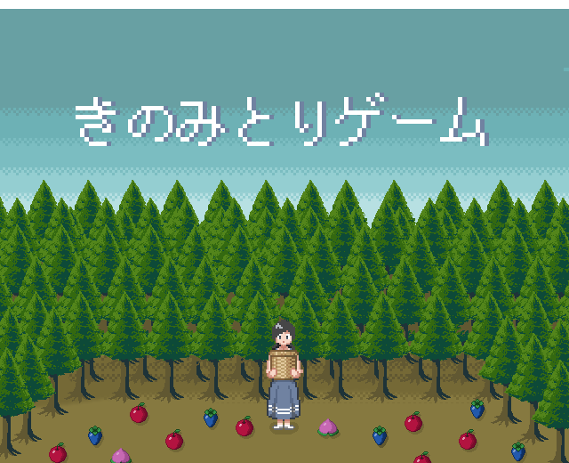
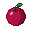
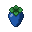
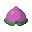
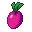
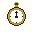
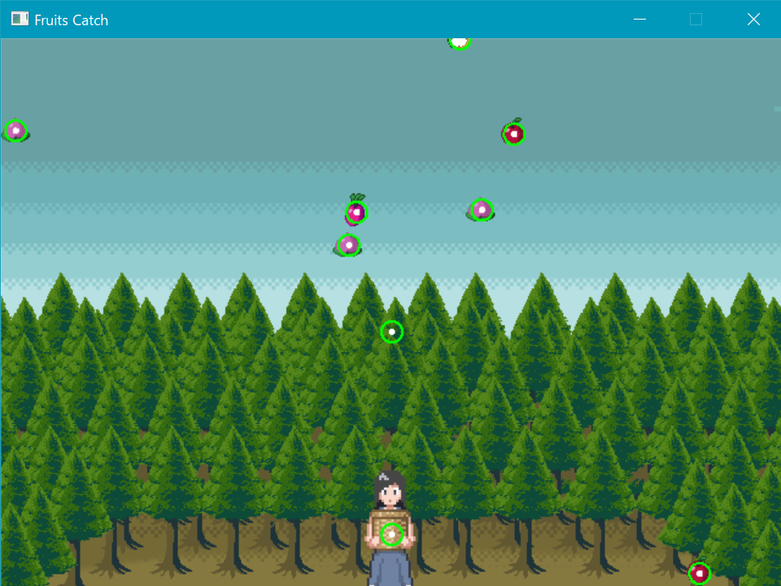

# Fruits Catch Game

## 概要

[Game Programming in C++](https://github.com/gameprogcpp/code)のプログラムをベースに作成したゲームです．空から落下してくるフルーツをプレイヤーを移動させてキャッチします．ゲームエンジンやライブラリを使用しておらず，ゲームプログラミングの基礎を理解する目的で作成しました．

    

## 開発環境

- Windows 10  
- Microsoft Visual Studio 2019  
- C++17  

## 外部ライブラリ

- [SDL2](https://github.com/libsdl-org/SDL/tree/SDL2)
- [SDL_image](https://github.com/libsdl-org/SDL_image/)

## 実行方法

SDLライブラリをインストールして，Visual Stusioのプロパティをパスが通るように変更してビルドしてください．環境構築の流れは[こちらの記事](https://www.kuroshum.com/entry/2019/07/18/%E3%82%B2%E3%83%BC%E3%83%A0%E3%83%97%E3%83%AD%E3%82%B0%E3%83%A9%E3%83%9F%E3%83%B3%E3%82%B0C++%E3%81%AE%E7%92%B0%E5%A2%83%E6%A7%8B%E7%AF%89(SDL))の記事が参考になると思います．

## 遊び方

制限時間30秒の間，空からフルーツが落ちてくるので十字キーでプレイヤーを操作してキャッチします．フルーツをキャッチするとスコアが加算されます．赤いフルーツは20点，青いフルーツは50点，ピンクのフルーツは200点です．スコアが1000点を超えるとゲームクリアです．

    
    
    

時々，上記のフルーツ以外が落ちてくることがあります．
濃いピンクのオブジェクトはキャッチするとスコアが100点減算されてしまいます．時計のオブジェクトはキャッチすると制限時間が5秒延長します．

    
    

### TIPS

- フルーツごとに速度が異なるので気をつけましょう．
- 赤いフルーツは意外と得点が低いので優先度を下げでもいいかもしれません．

## プレイ動画

実際にプレイしている`.gif`アニメーションがこちらになります．
長時間かつ高画質版は`example/play.mp4`をご覧ください．

    

## 特徴

### コンポーネントベースのオブジェクト指向

本ゲームは[Game Programming in C++](https://github.com/gameprogcpp/code)のChapter3をベースとしており，低レイヤーのマルチメディアライブラリ[SDL2](https://github.com/libsdl-org/SDL/tree/SDL2)，[SDL_image](https://github.com/libsdl-org/SDL_image/)を用いた画像の描画や，コンポーネントベースのクラス設計が実装されています．コンポーネントにはゲームオブジェクトの移動処理を行う`MoveComponent`クラスや画像の描画を行う`SpriteComponent`クラスがあり，参照先のゲームオブジェクトへのポインタを所持します．これにより，コンポーネントを介してゲームオブジェクトのパラメータの取得や設定が行えます．

### Game Programming in C++(Chapter3)にない要素

**ジェネレーターの実装**  
本ゲームではフルーツが画面上部から無数に落下しています．これらのフルーツはゲーム初期化時に一括でメモリ確保をせずに，プレイ中に動的確保して画面外に出たらメモリを解放するように実装しています．フルーツの動的な生成はジェネレータークラス`FrutisGenerator`により実現しています．

**キャラクターアニメーション**  
キー入力に応じたプレイヤーのアニメーション切り替えを実装しています．キー入力の状態に応じて描画するフレームの範囲を変更することで実現しています．

**デバッグ機能**  
プレイヤーとフルーツの交差判定に使用する円と円周の描画も実装しています．SDLライブラリでは円の描画は行えず，円は点と線の描画を組み合わせることで実現しています．実装は`Utility.h`，`Utility.cpp`にあります．デバッグモードは`game.h`の`IS_DEBUG_MODE`を`true`にすることで行えます．

**自作アセット**  
本ゲームのアセット(プレイヤー，フルーツ，背景)はすべてAdobe Photoshopで自作しています．

    
     
    デバッグ機能の例: 交差判定に使用される円を緑と白の円で可視化

## 今後の課題

- TrueTypeフォントの読み込みと描画を実装(スコア/残り時間描画用)
- フルーツをキャッチした際のインタラクションの実装(効果音・エフェクトなど)
- タイトル/リザルト画面と画面遷移の実装

## 参考文献

Sanjay Madhav(著), 吉川邦夫(翻訳), 今給黎 隆(監訳). "ゲームプログラミング C++". 2018.  
Sanjay Madhav. "[Game Programming in C++ Code](https://github.com/gameprogcpp/code)". 2017.  